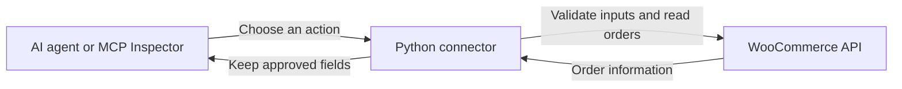

# WooCommerce order connector

**A safe bridge between an AI agent and a WooCommerce shop.** The agent can list orders, open one order, and search for matching orders. It cannot change them.

**Verified:** 60 automated tests, both MCP connection methods, and actual local WooCommerce with ten fictional orders. **Razorpay Agent Studio integration is still unverified** because platform access and private integration instructions were unavailable.

## Choose your starting point

| I want to… | Start here |
| --- | --- |
| See it work without a store account | [Quick demo](#quick-demo-windows) |
| Test actual WooCommerce | [Local WooCommerce lab](#local-woocommerce-lab) |
| Click tools and enter my own inputs | [Manual testing](#manual-testing-with-mcp-inspector) |
| Connect my existing test shop | [My own store](#connect-your-own-test-store) |
| Check the task requirements | [Feature checklist](#task-requirements) |

## What can the agent ask?

| Merchant question | Action | Example input |
| --- | --- | --- |
| “Show three orders.” | `list_orders` | `{"page": 1, "per_page": 3}` |
| “What is the status of order 1001?” | `get_order` | `{"order_id": 1001}` |
| “Which orders for customer 101 are processing?” | `search_orders` | `{"customer_id": 101, "status": "processing"}` |

These IDs are simulator examples. In an actual store, list the orders first and use the returned IDs.

Answers contain order/customer IDs, status, dates, currency, totals, and purchased products. Addresses, emails, phone numbers, customer notes, and extra metadata are omitted.

## How it works



**MCP** gives a client a standard menu of actions. **WooCommerce's API** is the official doorway to the shop. The connector uses the official MCP Python SDK and WooCommerce REST API v3.

Two ways to connect:

- **STDIO:** a local client starts the connector and talks directly to it.
- **Streamable HTTP:** a client contacts the running connector at `/mcp`, using a separate bearer token.

This project provides the tools and connection. It does not include an AI model or chat interface.

## Quick demo (Windows)

**You need:** Python 3.12 or newer. Open PowerShell in this repository's folder.

```powershell
py -3.12 -m venv .venv
.\.venv\Scripts\python.exe -m pip install -r requirements.lock
.\.venv\Scripts\python.exe -m scripts.demo
```

The demo makes real MCP calls against a **WooCommerce API simulator**, using ten fictional orders. It calls all three actions through STDIO and HTTP, checks authentication, and recovers from a simulated “too many requests” response. Temporary credentials stay in memory. Helper servers stop when the demo finishes.

**Success looks like:** each transport reports `"list_total": 10` and `"spec_matches_runtime": true`. The final report includes `"simulated_429_recovered": true` and `"missing_and_wrong_http_tokens_rejected": true`.

Run the automated checks:

```powershell
.\.venv\Scripts\python.exe -m pytest -q
```

Expected result: **60 passed**. GitHub Actions also runs tests and the demo on Windows and Ubuntu with Python 3.12 and 3.14.

<details>
<summary>Using macOS or Linux?</summary>

Create the environment with `python3 -m venv .venv`. Replace `.\.venv\Scripts\python.exe` in the Python commands with `.venv/bin/python`. Tests and the simulator demo passed in Ubuntu CI. Docker lab provisioning was validated locally on Windows only.

</details>

## Local WooCommerce lab

This runs **actual WordPress and WooCommerce**, using fictional records.

**You need:** the Python setup above and Docker Desktop running with its Linux engine. Initial downloads require internet access and may take several minutes.

```powershell
.\.venv\Scripts\python.exe test-store/bootstrap.py
.\.venv\Scripts\python.exe -m scripts.live_validate
```

The first command creates ten fictional orders, three fictional customers, and a Read-only API key. It prints a customer ID for later tests. The second checks both MCP transports and writes a credential-free [live report](LIVE_VALIDATION.json).

The store runs at `https://localhost:8443`. The connector verifies its certificate using a local CA file. Browsers do not automatically trust that CA; these API tests do not require opening the store in a browser or disabling TLS verification.

Passwords and keys are generated locally, under ignored `test-store/.secrets/` files and `test-store/.env`. The development helper seeds the disposable store separately; seeding is never an MCP action.

<details>
<summary>Stop the lab or run a single smoke test</summary>

Stop containers while keeping their data:

```powershell
docker compose --project-directory test-store down
```

For a single STDIO check, replace `2` with the customer ID printed by bootstrap:

```powershell
.\.venv\Scripts\python.exe -m dotenv -f test-store/.secrets/connector.env run -- .\.venv\Scripts\python.exe -m scripts.smoke --transport stdio --customer-id 2
```

The smoke client initializes MCP, discovers tools, calls all three, and checks that discovery matches `mcp-tools.json`. It needs at least one fictional order.

Bootstrap can be rerun on the same lab without duplicating the seeded orders. WordPress 6.8.3 and WooCommerce 10.2.2 are fixed compatibility targets for this isolated lab, not a production deployment recommendation.

</details>

## Manual testing with MCP Inspector

**Inspector is the testing screen:** choose an action, enter values, and see its answer. Set up the local WooCommerce lab first. You also need Node.js 22.7.5 or newer.

From the repository folder:

```powershell
$connectorPython = ((Resolve-Path .\.venv\Scripts\python.exe).Path).Replace('\', '/')
npx.cmd --yes @modelcontextprotocol/inspector@1.0.2 $connectorPython -m dotenv -f test-store/.secrets/connector.env run -- $connectorPython -m wc_connector.server
```

Open the browser link printed by Inspector, including its local session token. Keep **STDIO** selected. Click **Connect → Tools → List Tools**.

| Try this action | Inputs | Expected result |
| --- | --- | --- |
| `list_orders` | `page: 1`, `per_page: 3` | Three orders; 10 total |
| `get_order` | An order ID from that list | That order's summary |
| `search_orders` | A customer ID from that list and `status: processing` | Orders matching both filters; possibly an empty list |
| `get_order` | `order_id: 2147483647` | An order-not-found error |
| `search_orders` | Leave all filters blank | An error asking for a filter |
| `list_orders` | `per_page: 101` | A validation error |

Click **Run Tool** after entering values; scroll down if the output schema pushes the button below the visible area. Leave unused optional search fields blank. Stop Inspector with **Ctrl+C** in its terminal.

<details>
<summary>Troubleshooting: missing Tools, Unauthorized, or connection errors</summary>

- **No Tools tab:** connect first. Tools appear after initialization succeeds.
- **Unauthorized at `/mcp`:** opening this HTTP endpoint directly in a browser does not send the required authorization header. Use Inspector for manual testing.
- **Inspector token error:** open the full link printed by the current Inspector process, including its session token.
- **Windows path error:** use forward slashes in Inspector's arguments, as above. Its argument parser can treat backslashes as escape characters.
- **No orders:** run lab bootstrap first. The quick demo stops its temporary simulator when finished.
- **Store unavailable:** check Docker Desktop and the lab containers are running.

</details>

## Connect your own test store

<details>
<summary>Expand for API-key setup, STDIO, and HTTP instructions</summary>

1. In **WooCommerce → Settings → Advanced → REST API → Add key**, choose a dedicated user allowed to read orders. Select **Read** permission and generate the key and secret. WordPress user permissions still apply.
2. Copy `.env.example` to `.env` and fill in the credentials locally.
3. Set `WC_STORE_URL` to the base HTTPS shop URL, such as `https://shop.example`. Include any WordPress subdirectory; do not append `/wp-json/wc/v3`.
4. For HTTP only, generate a separate token and place it in `.env` as `MCP_BEARER_TOKEN`:

```powershell
.\.venv\Scripts\python.exe -c "import secrets; print(secrets.token_urlsafe(32))"
```

**Two different keys:** the WooCommerce key pair lets the connector read the shop. The bearer token lets a trusted HTTP client use the connector. Neither belongs in tool inputs. Never commit populated credentials.

For STDIO, configure your MCP client to launch the environment's Python executable with `-m wc_connector.server`, using this repository as its working directory. Supply store settings through its environment or the local `.env`. STDIO relies on access to the local process and credential files; it does not use the HTTP bearer token.

For HTTP, keep this running in one terminal:

```powershell
.\.venv\Scripts\python.exe -m wc_connector.server --transport http --port 8000
```

Configure your client for **Streamable HTTP**, URL `http://127.0.0.1:8000/mcp`, and header `Authorization: Bearer <your-token>`.

In another terminal, test a shop containing fictional orders. Replace `101` with a registered fictional customer's ID:

```powershell
.\.venv\Scripts\python.exe -m scripts.smoke --transport stdio --customer-id 101
.\.venv\Scripts\python.exe -m scripts.smoke --transport http --customer-id 101
```

The STDIO test launches its own server. HTTP testing needs the server above running. Stop it with **Ctrl+C**.

For the Docker lab's HTTP server and smoke test, prefix each Python command with `python -m dotenv -f test-store/.secrets/connector.env run --`, using the virtual environment's Python executable for both occurrences of Python.

Remote use requires HTTPS and a client supporting the authorization header. The delivered server binds only to loopback. A public deployment needs a reverse proxy, allowed host/origin restrictions, and SDK host-validation configuration. The shared token is private API-key protection, not MCP OAuth or per-user authorization.

</details>

## Task requirements

| Required feature | Where it is implemented |
| --- | --- |
| One merchant tool | WooCommerce REST API v3 orders |
| API key or OAuth login | Read-only key/secret authentication in [client.py](wc_connector/client.py); environment loading in [config.py](wc_connector/config.py) |
| List, get, and search | Exactly three MCP actions in [server.py](wc_connector/server.py) |
| Rate-limit handling | `Retry-After`, backoff with jitter, three retries, and a 60-second total budget in [client.py](wc_connector/client.py) |
| MCP menu and schemas | [mcp-tools.json](mcp-tools.json), exported from registered tools with input/output schemas and read-only annotations |
| Capabilities and limitations | [CAPABILITIES.md](CAPABILITIES.md) |
| Runnable code and setup | Python source, pinned [requirements.lock](requirements.lock), placeholder [.env.example](.env.example), and the steps above |
| Tests and fictional demo | [tests/](tests/), simulator, Docker lab, and [VALIDATION.md](VALIDATION.md) |
| No packaged credentials or real customer data | Fictional fixtures; generated credential files are Git-ignored |

The JSON specification is the menu; the running server performs discovery and calls. Smoke tests compare the exported menu with runtime discovery. After changing tool definitions, regenerate it with:

```powershell
.\.venv\Scripts\python.exe -m scripts.export_spec
```

## Safety and limits, in plain language

- **Read only:** fixed orders endpoints and GET requests only. The Read key also restricts writes; the local validation confirmed write rejection.
- **Less personal information:** [models.py](wc_connector/models.py) keeps approved fields. This excludes sensitive fields; it is not general text redaction. Customer IDs and product names remain, and product names are not scanned for personal information.
- **Safe errors:** controlled messages replace raw response bodies and exception details. The connector does not print credentials, and HTTP access logs are disabled. There is no general-purpose log-redaction filter.
- **One page at a time:** default 20, maximum 100. Follow `next_page` until `null`. Orders can change between calls, so pages are not a frozen snapshot.
- **Customer means ID:** use a registered WooCommerce customer ID. Guest orders have ID 0 and appear in lists, but cannot be selected using the customer filter.
- **Native search:** `query` follows WooCommerce's search behavior; exact name/email matching is not promised. Filters combine with AND. The simulator matches order IDs only.
- **Validated inputs:** positive IDs/pages, page sizes 1–100, standard statuses, and timezone-aware dates. Dates filter creation time and are normalized to UTC. The store determines boundary inclusion; custom plugin statuses are unsupported.
- **Bounded retries:** HTTP 429, 502/503/504, and transient network failures can retry. Authentication failures and missing orders do not retry. A required wait exceeding the remaining budget returns an error instead of retrying too soon. Actual store/host quotas vary.
- **One store:** no multi-merchant support, cache, bulk export, background sync, distributed quota coordination, or per-user permissions.
- **Untrusted text:** product/order strings are data, not instructions for an agent.
- **Agent Studio remains unverified:** MCP works locally. Razorpay platform access and private integration requirements are needed for the next step. A client requiring MCP OAuth cannot use this bearer-token gate unchanged.

## More detail when you need it

| Document | Contents |
| --- | --- |
| [Capabilities](CAPABILITIES.md) | What the agent can and cannot do |
| [Architecture](ARCHITECTURE.md) | Components, authentication, and design choices |
| [Validation](VALIDATION.md) | Passed checks, reproduction steps, and remaining limitations |
| [Live report](LIVE_VALIDATION.json) | Sanitized results from actual local WooCommerce |
| [Tool specification](mcp-tools.json) | Exact inputs, outputs, and annotations |

Official references: [WooCommerce authentication](https://developer.woocommerce.com/docs/apis/rest-api/authentication/), [orders API](https://developer.woocommerce.com/docs/apis/rest-api/v3/orders/), [MCP Python SDK](https://github.com/modelcontextprotocol/python-sdk), and [MCP Inspector](https://github.com/modelcontextprotocol/inspector).

This project pins the MCP v1 SDK API to `mcp==1.30.0`. The Inspector command uses the v1 testing interface verified for this project.
